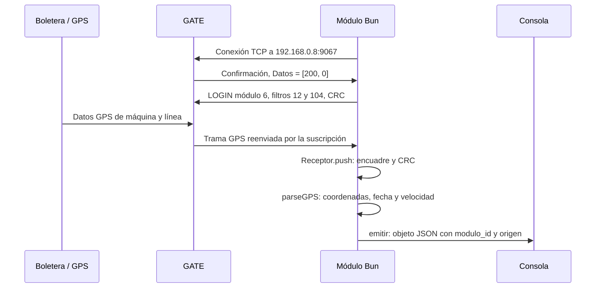

# Del PDF al código: guía del módulo GPS para principiantes

Esta guía acompaña a los comentarios **JSDoc** de [modulo.js](../modulo.js). JSDoc cumple en JavaScript una función similar a JavaDoc en Java: documenta el código junto a sus funciones, parámetros y resultados.

El objetivo es seguir una posición desde la boletera hasta el objeto JSON que muestra la terminal.

## Conceptos que conviene distinguir

| Concepto | Qué significa aquí |
| --- | --- |
| Boletera/GPS | Equipo que genera posiciones, fecha y velocidad. |
| GATE | Servidor que recibe información de las boleteras y la reenvía a módulos suscritos. |
| Módulo | Nuestro programa cliente, registrado por defecto como módulo `6`. |
| Socket TCP | Conexión por la que el programa envía y recibe bytes. |
| Stream | Flujo continuo de bytes; una lectura no equivale necesariamente a un mensaje. |
| Trama | Mensaje binario completo que sigue el protocolo. Se dice «trama», no «tramo». |
| Byte | Número entero entre 0 y 255, formado por ocho bits. |
| Instrucción | Código que indica qué significa el mensaje: `12` GPS, `200` LOGIN, etc. |
| Callback | Función que otra parte del programa llama cuando sucede un evento. |
| Parser | Función que interpreta bytes y los convierte en campos con significado. |
| JSON | Representación textual del objeto que contiene los datos decodificados. |

No se debe confundir `modulo_id: 6` con `maquina: 72`. El primero identifica al receptor; el segundo, al origen de una posición. Muchas máquinas pueden enviar datos a un mismo módulo.

## Cómo leer los comentarios JSDoc

Los comentarios empiezan con `/**` y terminan con `*/`. No se ejecutan ni envían datos: ayudan a comprender el programa y permiten que el editor muestre información al situar el cursor sobre una función.

| Etiqueta | Qué explica |
| --- | --- |
| `@fileoverview` | Visión general del archivo y relación con el PDF. |
| `@param` | Datos que recibe una función. |
| `@returns` | Resultado que devuelve. |
| `@throws` | Condiciones en las que puede lanzar un error. |
| `@example` | Uso concreto de la función. |
| `@typedef` / `@property` | Forma de un objeto y significado de sus campos. |
| `@callback` | Forma de una función que se entrega a otra parte del programa. |
| `@see` | Referencia a otra función o documentación relacionada. |

Por ejemplo, la documentación de `crearLogin()` permite entender que devuelve bytes preparados para enviar. Su retorno **no implica** que el GATE haya recibido esos bytes. Eso ocurre más adelante, con `socket.write()`.

## Las ocho secciones del PDF, llevadas al código

Estas son las ocho secciones del documento. Los ocho eventos TCP de Bun son otro conjunto distinto, explicado después.

### 1. Tramas: cómo se organiza un mensaje

El PDF presenta una envoltura con identificador, número de datos, datos y CRC. `codificarTrama()` la construye y `Receptor.push()` la interpreta:

```text
ID | Count | Datos | CRC
 1      1     N      2  bytes
```

La trama completa admite hasta 128 bytes. El LOGIN utilizado por defecto es:

```text
124 | 5 | 200-6-2-12-104 | 175-208
```

`codificarTrama()` devuelve un `Uint8Array`: una secuencia binaria. Los guiones sirven para explicar el mensaje; no se envía un texto con guiones al servidor.

### 2. Identificador: reconocer el inicio

El PDF describe `123` para la envoltura general y utiliza `124` en las tramas de módulos. El receptor admite ambos marcadores:

```javascript
[123, 124].includes(buffer[offset])
```

Aquí `offset` es la posición que se está examinando dentro del buffer. Esos marcadores no representan al módulo `6` ni a la instrucción `12`. El formato antiguo sin Count no se implementa en este cliente.

### 3. Número de datos: saber cuándo la trama está completa

Count cuenta únicamente el bloque Datos. En el LOGIN hay cinco bytes de datos:

```text
200, 6, 2, 12, 104
```

Por eso la longitud total es `5 + 4 = 9` bytes. En recepción se calcula:

```javascript
const total = buffer[offset + 1] + 4;
```

Los cuatro bytes extra corresponden a ID, Count y dos bytes CRC.

TCP puede entregar primero `[124, 2, 200]` y después `[0, 253, 159]`. Ninguna lectura aislada contiene la confirmación completa. `Receptor` conserva la primera y las une antes de interpretarlas. También puede separar varias tramas que llegan concatenadas.

### 4. CRC: comprobar integridad

El CRC es un cálculo sobre bytes. Si al recalcularlo se obtiene el mismo valor que incluye la trama, la comprobación pasa. No es cifrado ni demuestra que una coordenada sea geográficamente válida.

La función `calcularCRCGate()` utiliza el perfil corroborado con el servidor:

| Parámetro | Valor |
| --- | --- |
| Polinomio | `0x1021` |
| Acumulador inicial | `0x0000` |
| Bytes incluidos | Solo Datos |
| Orden transmitido | Primero byte bajo, después byte alto |

```javascript
calcularCRCGate([200, 6, 2, 12, 104]); // [175, 208]
```

El PDF nombra CRC1021, pero no detalla todos esos parámetros. La captura real permitió comprobarlos. `calcularCRC1021()` conserva la variante CCITT-FALSE proporcionada inicialmente como opción explícita; no es el perfil predeterminado del servidor real.

El CRC puede ser correcto y el GPS ser rechazado después. Por ejemplo, los bytes de una coordenada pueden transmitirse íntegramente, pero corresponder a una escala diferente de la documentada.

### 5. Datos: conocer el significado del mensaje

Después de validar la trama, `data()` obtiene el bloque interno:

```javascript
const datos = trama.subarray(2, -2);
```

`2` omite ID y Count; `-2` excluye los dos bytes finales CRC. Así, en una posición queda:

```text
12 | Máquina | Línea | Latitud | Longitud | Fecha | Velocidad | Otros campos
```

La primera posición del bloque es la instrucción. El resto depende de esa instrucción. Los números `100` y `8` del caso GPS del PDF son una máquina y una línea de referencia; el código lee los identificadores de cada mensaje recibido.

### 6. Lista de instrucciones: seleccionar y decodificar GPS

Esta actividad implementa la sección **6.2, Datos GPS (12)**. No requiere implementar toda la lista de órdenes de configuración, reset, marcas o consola.

`parseGPS()` empieza comprobando:

```javascript
if (datos[0] !== 12) return null;
```

Para una posición, interpreta estos offsets, contados desde cero dentro de Datos:

| Offset | Campo | Código o interpretación |
| --- | --- | --- |
| `0` | Instrucción | `12` |
| `1` | Máquina | `datos[1]` |
| `2` | Línea | `datos[2]` |
| `3–6` | Latitud | `vista.getUint32(3, false) / -100000` |
| `7–10` | Longitud | `vista.getUint32(7, false) / -100000` |
| `11–16` | Fecha y hora | Día, mes, año, hora, minuto y segundos compartidos |
| `17` | Velocidad de la posición | `datos[17]` |
| `18` | Velocidad máxima entre envíos | No se incluye en la salida solicitada |
| `19–21` | pDOP, dirección y flags | No se incluyen en la salida |
| `22` en adelante | Contadores/extensiones | Se conservan en la trama, pero no se interpretan |

`false` en `getUint32` significa big-endian: primero el byte de mayor peso. Eso no tiene por qué coincidir con el orden de los bytes del CRC.

El byte de segundos comparte un bit con la dirección. El código usa `compartido & 127`; por ejemplo, `182 & 127 = 54`. La fecha final no añade zona horaria porque el bloque GPS no la especifica.

**De dónde sale la velocidad:** la boletera envía un valor en el byte 17. El GATE lo reenvía y el módulo lo copia al campo `velocidad`. No se calcula midiendo la distancia entre posiciones ni se aplica un factor de conversión. En la trama de referencia del PDF ese byte es `30`, por lo que el JSON contiene `"velocidad": 30`.

Al contar sobre la trama completa, ese campo está en el offset 19, porque delante hay dos bytes de envoltura. El código usa 17 porque previamente retiró ID y Count.

El PDF no especifica la unidad de esa velocidad. No se etiqueta como km/h sin otra confirmación. Un cero es un valor válido recibido del origen; no significa ausencia de datos por sí solo.

### 7. Tramas de consola: entender el límite del alcance

La consola es la botonera de la boletera. Sus mensajes usan la instrucción `80` y una estructura distinta. El GPS puede actuar como intermediario entre consola y GATE, según esta sección del PDF.

El cliente actual no solicita `80`. `crearLogin()` pide `12` y `104`, y `parseGPS()` solo decodifica `12`. Esto evita tratar respuestas de botones, boletos o perfiles como si fueran coordenadas.

### 8. Módulos: registrarse y pedir las instrucciones

`iniciarCliente()` crea los manejadores e inicia la conexión a `192.168.0.8:9067` mediante `Bun.connect`.

GATE envía una confirmación. En la sesión real se observó:

```text
124-2-200-0-253-159
```

Tras retirar la envoltura, Datos es `[200, 0]`. El manejador `data()` lo reconoce y prepara el LOGIN:

```javascript
pendiente = Buffer.from(login);
vaciar(socket);
```

Ese `login` se construyó con:

```javascript
codificarTrama([200, moduloId, 2, 12, 104], { perfilCRC });
```

| Byte del bloque | Solicitud |
| --- | --- |
| `200` | Registrar un módulo |
| `moduloId` | Identificar al cliente, `6` por defecto |
| `2` | Hay dos filtros a continuación |
| `12` | Reenviar instrucciones GPS |
| `104` | Reenviar errores de módulo |

El envío efectivo se realiza aquí, dentro de `vaciar()`:

```javascript
const cantidad = socket.write(pendiente);
```

Un filtro no es una solicitud periódica de posición ni una máquina. Indica qué códigos de instrucción quiere escuchar esta sesión. Se envía un LOGIN por conexión; si se reconecta, se repite el handshake para la nueva conexión.

## Recorrido completo: cómo los bytes se convierten en JSON



Los puntos concretos para leer en el código son:

1. `leerConfiguracion()`: selecciona el ID del módulo, el CRC y la presentación.
2. `iniciarCliente()`: coordina la conexión y las reconexiones.
3. `crearManejadores()`: proporciona a Bun las funciones que reaccionan a eventos.
4. `data()`: procesa la confirmación y los mensajes que llegan después.
5. `Receptor.push()`: entrega mensajes completos que superan la verificación.
6. `parseGPS()`: transforma los bytes de una posición en un objeto JavaScript.
7. `{ modulo_id: moduloId, ...gps }`: añade al objeto la identidad del receptor.
8. `emitir(posicion)`: llama al destino de salida; normalmente `crearSalidaGPS()` serializa con `JSON.stringify()` y escribe por consola.

Express conserva el estado y los contadores en `app.locals.gate`. La conexión TCP la realiza Bun. No hay `app.listen()` ni peticiones HTTP en este flujo.

## Los ocho eventos TCP de Bun

| Evento | Qué significa | Acción del programa |
| --- | --- | --- |
| `open` | TCP se abrió | Espera la confirmación del GATE |
| `data` | Llegaron bytes | Completa tramas, responde al saludo y procesa GPS |
| `drain` | Se puede volver a escribir | Completa los bytes del LOGIN que faltaban |
| `close` | El socket cerró | Limpia y habilita reconexión |
| `error` | Falló la conexión durante su operación | Registra, cierra y habilita reintento |
| `connectError` | No se logró conectar | Registra el fallo y habilita reintento |
| `end` | GATE terminó de enviar | Cierra el extremo local y habilita reconexión |
| `timeout` | Venció el plazo de inactividad | Termina esa conexión y habilita reintento |

`socket.write()` puede aceptar solo parte del LOGIN. Se conserva el resto para `drain`, evitando perder bytes. Los plazos de 10 segundos para el saludo y 120 segundos de inactividad son decisiones de esta aplicación, no nuevos bytes del protocolo.

## Presentación de velocidad, verificación y errores

Una línea JSON larga puede superar el ancho de la terminal. Por ejemplo, `14` puede verse como `1` en una línea y `4` en la siguiente sin que el valor esté corrupto.

Para una demostración legible, incluso al usar una tubería de PowerShell:

```powershell
$env:GATE_OUTPUT = 'pretty'
bun start
```

Cada campo queda en su propia línea, incluida `"velocidad": 14`. Para almacenar un objeto por línea y analizarlo después:

```powershell
$env:GATE_OUTPUT = 'ndjson'
bun run modulo.js 1> gps.ndjson 2> gate-eventos.log
```

`auto`, el valor predeterminado, elige la presentación según si la salida es una terminal o está redirigida. El contenido es el mismo en ambos formatos.

La verificación de 15 segundos ahora guarda **todas** las posiciones en `verificacion-gate.json`, campo `posiciones`. También produce `verificacion-gate.md` para leer los contadores y errores. El límite anterior de cinco muestras era una decisión del script de verificación, no una limitación de GATE ni del módulo.

Los errores GPS identifican máquina, línea, tamaño en bytes, valores decodificados fuera de rango y la secuencia original en una cadena decimal. `longitud_bytes` significa tamaño del bloque; `longitud_decodificada` significa coordenada geográfica.

La recepción en tiempo real no cambia la fecha que envía el GPS. Si GATE reenvía registros acumulados, se mantienen sus fechas originales. El contador de posiciones tampoco equivale al número de máquinas distintas.

## Fuentes y procedencia

- **Detalle de Tramas de GATE** (documento proporcionado para la actividad): ocho secciones del protocolo y offsets GPS de la sección 6.2.
- [Verificación real](../verificacion-gate.json): evidencia de la sesión y posiciones recibidas directamente del servidor.
- [JSDoc](https://jsdoc.app/about-getting-started), [parámetros](https://jsdoc.app/tags-param) y [ejemplos](https://jsdoc.app/tags-example): sintaxis de documentación.
- [TCP de Bun](https://bun.sh/docs/runtime/networking/tcp): conexión y callbacks.

El archivo `modulo.js` contiene las explicaciones junto a cada función. Esta guía da el orden de lectura; el README contiene los comandos de operación y validación.
